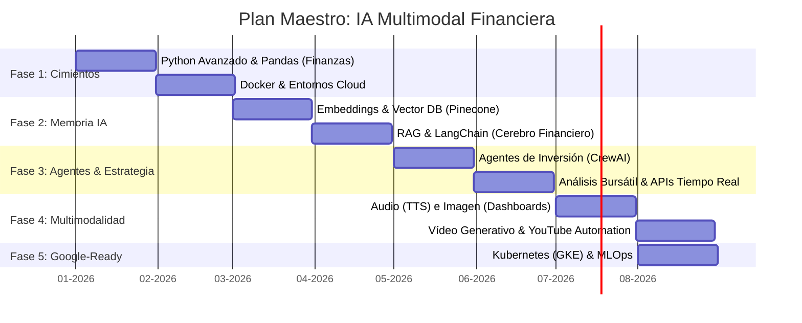

# IA Multimodal Financiera - Proyecto Derej

```mermaid
gantt
    title Plan Maestro: IA Multimodal Financiera
    dateFormat  YYYY-MM
    axisFormat  %m-%Y

    section Fase 1: Cimientos
    Python Avanzado & Pandas (Finanzas) :a1, 2026-01, 30d
    Docker & Entornos Cloud              :a2, after a1, 30d

    section Fase 2: Memoria IA
    Embeddings & Vector DB (Pinecone)    :b1, 2026-03, 30d
    RAG & LangChain (Cerebro Financiero) :b2, after b1, 30d

    section Fase 3: Agentes & Estrategia
    Agentes de Inversión (CrewAI)        :c1, 2026-05, 30d
    Análisis Bursátil & APIs Tiempo Real :c2, after c1, 30d

    section Fase 4: Multimodalidad
    Audio (TTS) e Imagen (Dashboards)    :d1, 2026-07, 30d
    Vídeo Generativo & YouTube Automation:d2, after d1, 30d

    section Fase 5: Google-Ready
    Kubernetes (GKE) & MLOps             :e1, 2026-08, 30d
```
